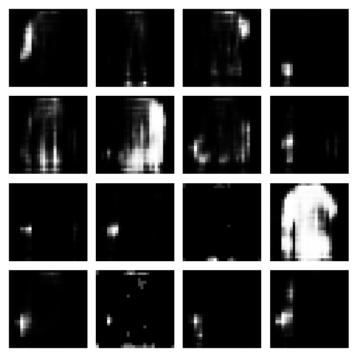
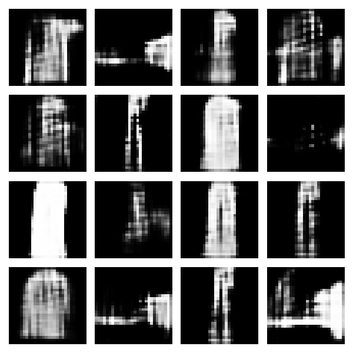
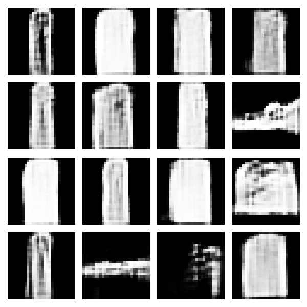
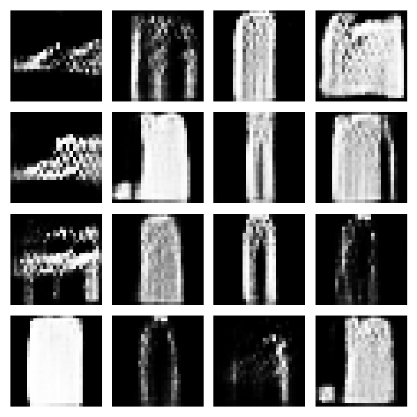
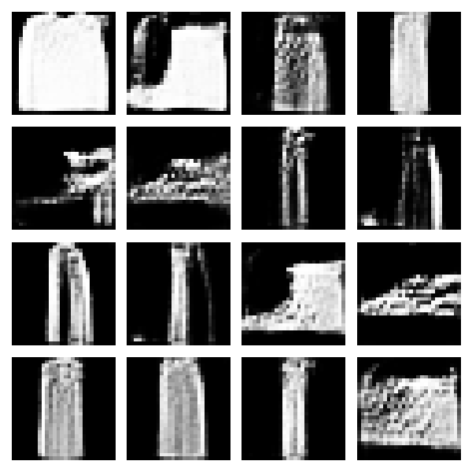
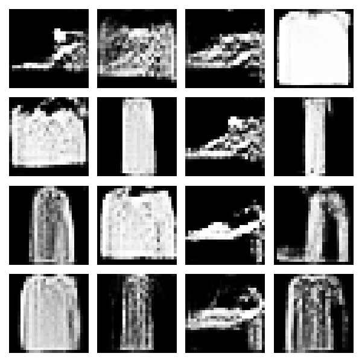
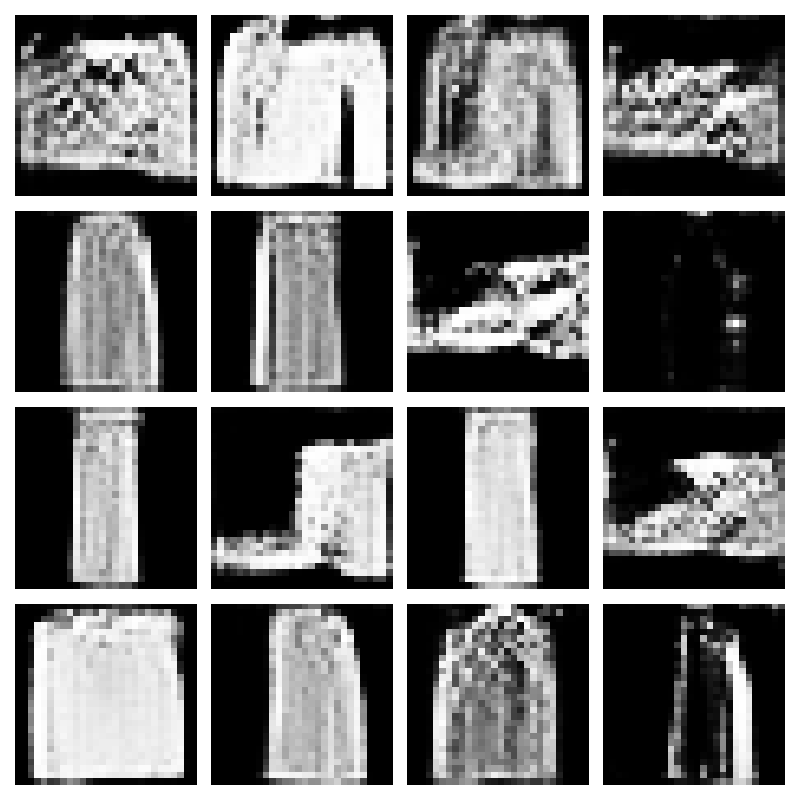
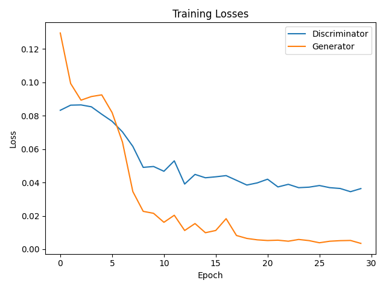

# Generative Adversarial Network (GAN) for Fashion MNIST

This project implements a Deep Convolutional Generative Adversarial Network (DCGAN) from scratch in TensorFlow to generate realistic images of clothing items from the Fashion MNIST dataset. **Optimized for speed, efficiency, and TPU acceleration.**

## Motivation

I wanted to dive deep into the world of generative models by building a GAN from the ground up. This project was an opportunity to understand the intricate adversarial dynamic between a generator and a discriminator and to implement a custom training loop to manage their training. The implementation is optimized for faster training while maintaining quality results. For the final training, I leveraged Kaggle's free TPU resources to achieve even better performance and faster results.

## Features

-   **Custom GAN Architecture**: A `tf.keras.Model` subclass with a custom `train_step` to orchestrate the adversarial training.
-   **Optimized Deep Convolutional Models**:
    -   A **Generator** that uses `UpSampling2D` and `Conv2D` layers to transform a random noise vector into a 28x28 grayscale image (streamlined for speed).
    -   A **Discriminator** that uses `Conv2D` and `Dropout` layers to classify images as real or fake (reduced complexity).
-   **Mixed Precision & TPU Training**: Enabled for faster training on compatible GPUs and TPUs. The code is optimized for TPU usage and can be run efficiently on Kaggle notebooks with TPU acceleration.
-   **Efficient Data Pipeline**: Uses `tf.keras.datasets` for reliable data loading and `tf.data.Dataset` with optimized batch sizes for faster training.
-   **Smart Training Progress Visualization**: Implements a custom Keras `Callback` that saves generated images every 5 epochs instead of every epoch, significantly reducing training time.
-   **Comprehensive Results**: Saves the final trained models, a plot of the training losses, and a grid of high-quality generated images.

## Speed Optimizations

This implementation includes several optimizations to reduce training time on TPUs:

1. **TPU Acceleration**: The code is optimized for TPUs, allowing for much faster training on platforms like Kaggle.
2. **Reduced Epochs**: Training for 30 epochs instead of 50 (GANs often converge faster)
3. **Larger Batch Size**: Increased for better hardware utilization
4. **Simplified Architecture**: Reduced model complexity while maintaining quality
5. **Mixed Precision**: Enabled float16/bfloat16 training for faster computation
6. **Optimized Callback**: Saves images every 5 epochs instead of every epoch
7. **Balanced Learning Rates**: Both generator and discriminator use the same learning rate for stability

## Methodology

The GAN is trained through an adversarial process:
1.  The **Generator** takes a 256-dimensional random noise vector and tries to produce a realistic image of a clothing item.
2.  The **Discriminator** is shown a mix of real images from the Fashion MNIST dataset and fake images from the Generator. Its goal is to correctly identify which are which.
3.  **Discriminator Training**: Its weights are updated based on its ability to distinguish real from fake.
4.  **Generator Training**: Its weights are updated based on its ability to *fool* the Discriminator into thinking its generated images are real.
5.  This process repeats, and over time, the Generator becomes better at creating convincing images, while the Discriminator becomes a better critic.

## Setup

Install the required Python libraries:
```bash
pip install tensorflow matplotlib numpy
```

## Usage

This project is designed to be run on **Kaggle Notebooks** with TPU acceleration. Running locally (via `python gan_fashion_mnist.py`) is not supported due to TPU-specific code and dependencies.

### How to Run on Kaggle

1. **Create a Kaggle Account**
   - If you don't have one, sign up at [kaggle.com](https://www.kaggle.com/).

2. **Open the Public Notebook**
   - Visit the public notebook here: [Kaggle Notebook (TPU Training)](https://www.kaggle.com/code/ivankoptiev/gan-fashion-mnist)
   - You can view results directly, or click "Copy & Edit" (top right) to create your own editable version.

3. **Set the Accelerator to TPU**
   - In your copied notebook, go to the menu: `Runtime` > `Change runtime type` (or the gear/settings icon at the top right).
   - Set the hardware accelerator to **TPU**.
   - Save the settings.

4. **Run the Notebook**
   - If you copied the code from GitHub, paste it into a new Kaggle notebook cell.
   - Click `Run All` or run cells step by step.
   - All outputs (images, plots) will be saved in the notebook's working directory and can be downloaded after training.

5. **(Optional) Upload Your Own Code**
   - You can also upload `gan_fashion_mnist.py` as a Kaggle script or notebook, but ensure you select TPU as the accelerator before running.

**Note:** Kaggle Notebooks are public by default, so others can also fork and run your notebook if they have a Kaggle account and available TPU quota.

## Outputs

-   `generated_images/`: A directory containing a grid of generated images saved every 5 epochs (e.g., `epoch_5.png`, `epoch_10.png`, `epoch_15.png`, `epoch_20.png`, `epoch_25.png`, `epoch_30.png`).
-   `training_loss.png`: A plot showing the generator and discriminator losses over time.
-   `final_generated_images.png`: A high-quality grid of 16 images produced by the final trained generator.

## Results

### Training Progression
The following images show the generator's progress. Early on, it produces noise, but over many epochs, it learns to generate recognizable shapes and, eventually, coherent images of clothing.

| Epoch 5 | Epoch 10 | Epoch 15 | Epoch 20 | Epoch 25 | Epoch 30 |
| :---: | :---: | :---: | :---: | :---: | :---: |
|  |  |  |  |  |  |

### Final Generated Images
After 30 epochs, the generator can produce a variety of plausible-looking fashion items. Some images may still have minor artifacts or fixed patterns, but overall, the results are visually impressive for a simple DCGAN.



### Training Losses
The loss plot shows the classic adversarial dynamic. Ideally, the losses should reach an equilibrium, indicating that neither the generator nor the discriminator is overpowering the other.



## Performance Improvements

- **Training Time**: Originally expected to be 50+ hours on a local CPU/GPU. After code optimization (mixed precision, larger batch size, simplified architecture, and less frequent image saving), reduced to ~15 hours on a good GPU. Final training on Kaggle TPU took less about 1 hour.
- **Memory Usage**: Optimized batch processing and model architecture
- **Hardware Utilization**: Efficient use of mixed precision, large batches, and TPU acceleration
- **Storage**: Reduced number of saved images (every 5 epochs vs every epoch)

## What I Learned

-   **Adversarial Training**: How to implement the delicate balance of training a generator and discriminator in a custom Keras model.
-   **Generative Architecture**: How to use upsampling and convolutions to scale a low-dimensional vector into a full image.
-   **GAN Stability**: The importance of careful learning rate selection and network architecture to prevent issues like mode collapse.
-   **Performance Optimization**: How to balance training speed with model quality through architectural choices and training parameters.
-   **Debugging with Callbacks**: How a custom callback that visualizes output at regular intervals is an invaluable tool for monitoring and debugging generative models.
-   **TPU Acceleration**: How to adapt code for TPU usage and leverage free cloud resources (Kaggle) for large-scale training.

## Challenges

-   **Training Stability**: GANs are notoriously difficult to train. Finding the right learning rates for both the generator and discriminator was a key challenge.
-   **Mode Collapse**: Early versions of the model sometimes suffered from mode collapse, where the generator would only produce a limited variety of outputs. This was addressed by tuning the architecture and learning rates.
-   **Speed vs Quality Trade-off**: Balancing training speed with generation quality required careful optimization of model architecture and training parameters.
-   **Computational Efficiency**: Implementing optimizations like mixed precision, efficient data pipelines, and TPU support while maintaining training stability.
-   **TPU Debugging**: Adapting the code for TPU required some trial and error, especially with mixed precision and distributed strategies.
-   **Kaggle Migration**: Moving the project to Kaggle for final training was a great decision, as it allowed for much faster experimentation and results.
-   **Visual Artifacts**: Some generated images still have minor fixed parts or artifacts, but overall, the results are strong for a simple DCGAN.

## License


This project is licensed under the MIT License.
